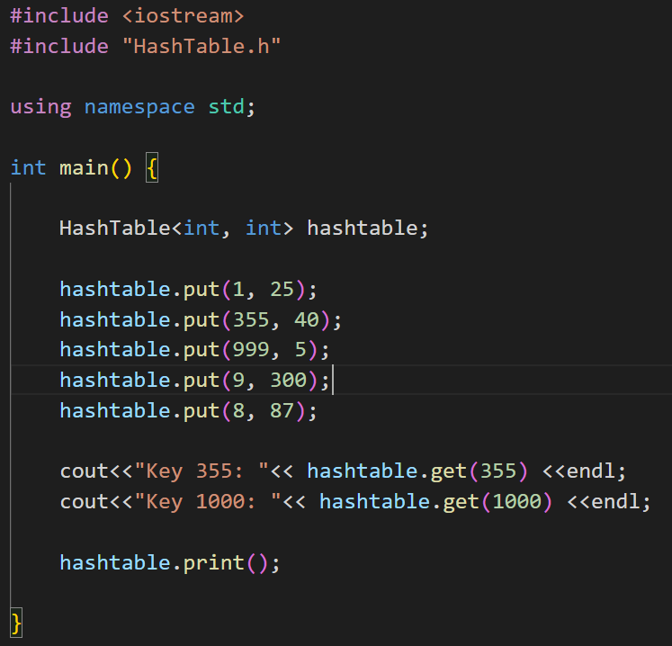
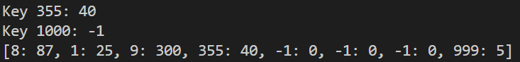

# HashTable

### **Keyler ve keylere ait olan value değerlerinden oluşan bir yapıdır.**

 

### *Şuan sadece int key ve sayisal value değerleri ile çalışmaktadır*

 

### *Default key: -1*

 

### *Default value: 0*

  

### **Kullanim örneği**

 

 

 